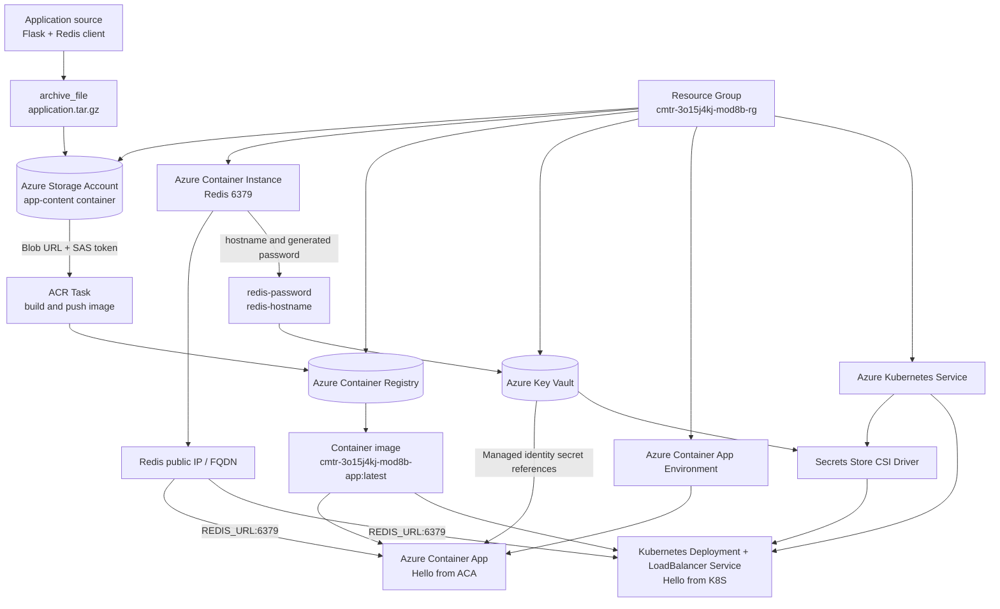

# Task 08.2 — Azure Container Applications and AKS

This task deploys the same Redis-connected Flask application to Azure
Container Apps (ACA) and Azure Kubernetes Service (AKS).

## Architecture



## Components

- **Storage Account** archives the `application` directory as a `tar.gz` blob.
- **ACR Task** uses the blob URL and SAS token as its build context, then
  pushes the application image to Azure Container Registry.
- **Redis ACI** runs the Redis image from Microsoft Artifact Registry with a
  generated password and exposes port `6379` through a public IP and DNS name.
- **Key Vault** stores the Redis hostname and password.
- **ACA** uses a user-assigned managed identity to read Key Vault secrets and
  pull the application image from ACR.
- **AKS** uses a managed identity, the Secrets Store CSI Driver, and Kubernetes
  manifests to read Key Vault secrets and pull the application image from ACR.
- **Kubernetes Service** exposes the AKS application through a public
  load-balancer IP.

## Terraform layout

```text
task08_b/
├── application/
├── k8s-manifests/
├── modules/
│   ├── aca/
│   ├── aci_redis/
│   ├── acr/
│   ├── aks/
│   ├── k8s/
│   ├── keyvault/
│   └── storage/
├── locals.tf
├── main.tf
├── outputs.tf
├── terraform.tfvars
├── variables.tf
└── versions.tf
```

## Outputs

After applying the configuration, Terraform exposes:

- `redis_fqdn` — Redis ACI DNS name.
- `aca_fqdn` — ACA application DNS name.
- `aks_lb_ip` — public IP address of the AKS application.

## Deployment

From the `task08_b` directory:

```powershell
terraform init
terraform fmt -check -recursive
terraform validate
terraform plan
terraform apply
```

