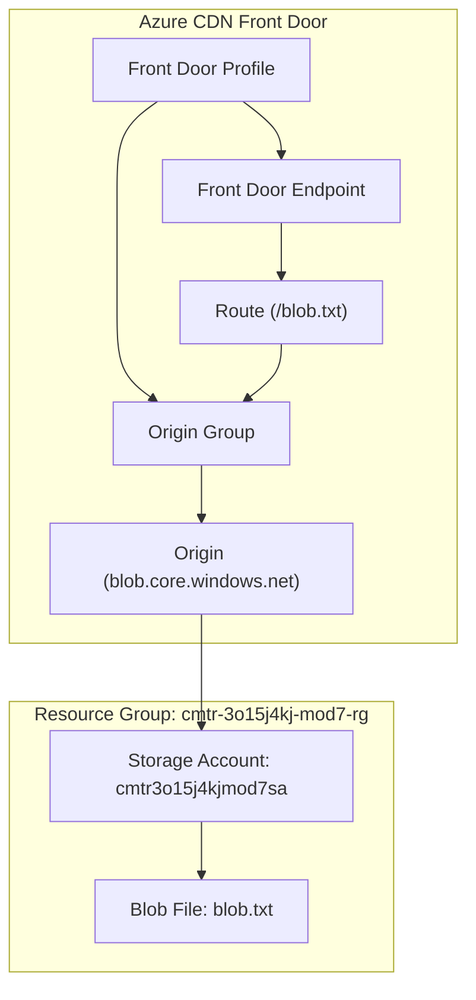

# Task 07 — Azure CDN Front Door with Terraform

## 📌 Overview
This project deploys an Azure CDN Front Door configuration using Terraform and connects it to an existing Azure Storage Account containing a blob file. The Resource Group and Storage Account are pre‑created and must be imported into Terraform state. The CDN Front Door endpoint exposes the blob file through a public URL.

The configuration follows all common task requirements: correct file structure, no backend definition, no local‑exec, no prevent_destroy, proper variable usage, and clean formatting.

---

## 📂 Project Structure

```
task07/
├── modules/
│   └── cdn/
│       ├── main.tf
│       ├── outputs.tf
│       └── variables.tf
├── locals.tf
├── main.tf
├── outputs.tf
├── terraform.tfvars
├── variables.tf
└── versions.tf
```

---

## Required Configuration

| Region: | Central India
| Resource Group name: | `cmtr-3o15j4kj-mod7-rg` |
| Resource Group ID: | `/subscriptions/8da553a7-8f4c-48a2-8701-dafce0b7b79b/resourceGroups/cmtr-3o15j4kj-mod7-rg` |
| Storage Account name: | `cmtr3o15j4kjmod7sa` |
| Storage Account ID: | `/subscriptions/8da553a7-8f4c-48a2-8701-dafce0b7b79b/resourceGroups/cmtr-3o15j4kj-mod7-rg/providers/Microsoft.Storage/storageAccounts/cmtr3o15j4kjmod7sa` |
| Blob filename: | `blob.txt` |
| CDN Front Door Profile name: | `cmtr-3o15j4kj-mod7-fd-profile` |
| CDN Front Door Profile SKU: | `Standard_AzureFrontDoor` |
| CDN Front Door Endpoint name: | `cmtr-3o15j4kj-mod7-fd-endpoint` |
| CDN Front Door Origin Group name: | `cmtr-3o15j4kj-mod7-fd-origin-group` |
| CDN Front Door Origin name: | `cmtr-3o15j4kj-mod7-fd-origin` |
| CDN Front Door Route name: | `default` |

---

## 📖 Architecture Diagram



---

## 🚀 Usage
```bash
# Initialize Terraform (downloads providers, sets up backend)
terraform init

# Format code (ensures all .tf files are clean and consistent)
terraform fmt

# Validate Terraform code (checks syntax and configuration correctness)
terraform validate

# Review the plan (shows what resources will be created/changed/destroyed)
terraform plan

# Apply the configuration (actually provisions resources in Azure)
terraform apply

# Destroy Terraform-managed resources (tears down everything created)
terraform destroy
```

---

## 📤 Outputs

After deployment, Terraform will output:
- **Azure CDN Front Door Endpoint Hostname:** → `endpoint_hostname`

---