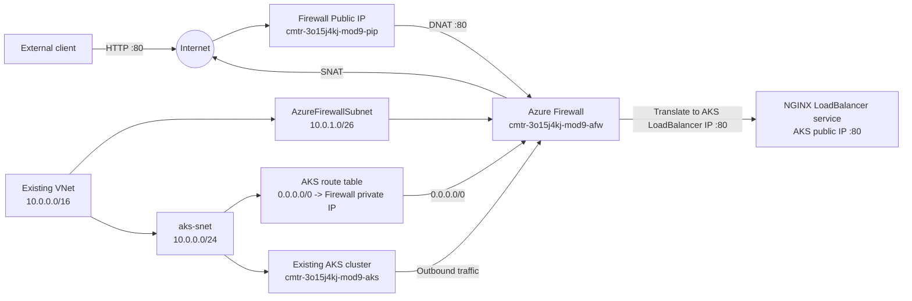

# Task 09 - Azure Firewall for AKS

This Terraform configuration deploys an Azure Firewall in front of an
existing Azure Kubernetes Service (AKS) cluster. It routes AKS outbound
traffic through the Firewall and publishes the NGINX service through the
Firewall public IP by using a DNAT rule.

## Architecture



## Traffic flows

### Inbound traffic

```text
Client
  -> Firewall public IP:80
  -> Azure Firewall DNAT rule
  -> AKS LoadBalancer public IP:80
  -> NGINX service
```

The Firewall NAT rule collection forwards HTTP and HTTPS traffic to the
configured `aks_loadbalancer_ip`.

### Outbound traffic

```text
AKS subnet
  -> Route table: 0.0.0.0/0
  -> Azure Firewall private IP
  -> Firewall public IP (SNAT)
  -> Internet
```

The route table is associated with `aks-snet`, so the AKS subnet uses the
Firewall as its next hop for default traffic.

## Resources

The root configuration in this directory:

- Reads the existing resource group, virtual network, and AKS subnet.
- Calls the reusable [`modules/afw`](./modules/afw) module.
- Exposes the Firewall public and private IP addresses.

The `afw` module creates:

- `AzureFirewallSubnet`
- Standard static Firewall public IP
- Azure Firewall
- AKS route table
- AKS subnet route table association
- Application rule collection
- Network rule collection
- NAT rule collection

Resource names use the required prefix:

```text
cmtr-3o15j4kj-mod9-<resource-abbreviation>
```

## Configuration

Input values are defined in [`terraform.tfvars`](./terraform.tfvars):

```hcl
location                      = "Central India"
resource_group_name           = "cmtr-3o15j4kj-mod9-rg"
virtual_network_name          = "cmtr-3o15j4kj-mod9-vnet"
aks_subnet_name               = "aks-snet"
virtual_network_address_space = "10.0.0.0/16"
aks_loadbalancer_ip           = "20.235.206.118"
```

`aks_loadbalancer_ip` must be the current public IP of the NGINX
`LoadBalancer` service. It can be checked with:

```bash
az aks command invoke \
  --resource-group cmtr-3o15j4kj-mod9-rg \
  --name cmtr-3o15j4kj-mod9-aks \
  --command "kubectl get svc -A -o wide"
```

## Deployment

Run Terraform from the `task09` directory:

```bash
terraform init
terraform fmt -recursive
terraform validate
terraform plan
terraform apply
```

The configuration uses the local Terraform backend by default and does not
declare a backend block.

After deployment, retrieve the Firewall addresses:

```bash
terraform output azure_firewall_public_ip
terraform output azure_firewall_private_ip
```

## AKS NSG access workaround

Depending on EPAM network policy, the AKS LoadBalancer may reject traffic
that is forwarded from the Firewall public IP. The task instructions provide
the following workaround. Run it from Azure Cloud Shell after obtaining the
current Firewall and AKS LoadBalancer IPs:

```bash
rg_name="cmtr-3o15j4kj-mod9-rg"
AKS_CLUSTER_NAME="cmtr-3o15j4kj-mod9-aks"
PUBLIC_IP_NAME="cmtr-3o15j4kj-mod9-pip"
LB_IP_ADDRESS="20.235.206.118"

public_ip_address=$(az network public-ip show \
  --resource-group "$rg_name" \
  --name "$PUBLIC_IP_NAME" \
  --query ipAddress \
  --output tsv)

aks_rg=$(az aks show \
  --name "$AKS_CLUSTER_NAME" \
  --resource-group "$rg_name" \
  --query nodeResourceGroup \
  --output tsv)

aks_nsg=$(az resource list \
  --resource-group "$aks_rg" \
  --resource-type Microsoft.Network/networkSecurityGroups \
  --query "[0].name" \
  --output tsv)

az network nsg rule create \
  --resource-group "$aks_rg" \
  --nsg-name "$aks_nsg" \
  --name AllowAccessFromFirewallPublicIPToLoadBalancerIP \
  --priority 400 \
  --access Allow \
  --protocol "*" \
  --direction Inbound \
  --source-address-prefix "$public_ip_address" \
  --source-port-range "*" \
  --destination-address-prefix "$LB_IP_ADDRESS" \
  --destination-port-range 80
```

If the Firewall public IP or AKS LoadBalancer IP changes, update the
configuration and the NSG rule accordingly.

## Validation

Check the NGINX endpoint through the Firewall public IP:

```bash
curl --head --max-time 30 http://<firewall-public-ip>
```

Expected result:

```text
HTTP/1.1 200 OK
```

The Terraform outputs are:

- `azure_firewall_public_ip`
- `azure_firewall_private_ip`
