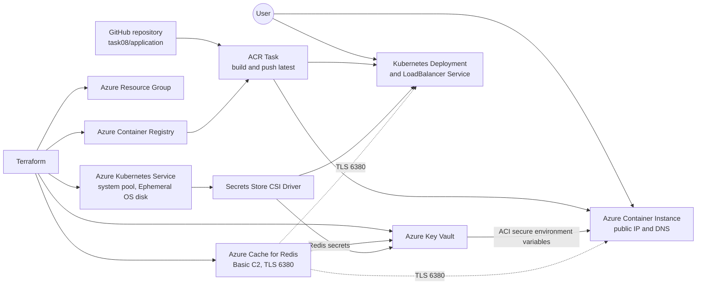

# Azure Cloud — Task 08

Terraform configuration for deploying a cloud-native Flask application to
Microsoft Azure Container Instances (ACI) and Azure Kubernetes Service (AKS).
The application stores its visit counter in Azure Cache for Redis over TLS.

## Contents

- [Architecture](#architecture)
- [Resources](#resources)
- [Repository layout](#repository-layout)
- [Prerequisites](#prerequisites)
- [Configuration](#configuration)
- [Deploy](#deploy)
- [Verify](#verify)
- [Destroy](#destroy)
- [Provider bootstrap note](#provider-bootstrap-note)
- [Security and operational notes](#security-and-operational-notes)

## Architecture



The deployment flow is:

1. Terraform creates the Azure infrastructure.
2. The ACR Task builds the application image from GitHub and pushes
   `cmtr-3o15j4kj-mod8-app:latest`.
3. ACI and AKS use the image from ACR.
4. Redis hostname and primary key are stored in Key Vault.
5. ACI receives the Redis values as secure environment variables.
6. AKS reads the same secrets through the Azure Key Vault Secrets Store CSI
   driver.
7. Both application instances increment the shared Redis `counter` key.

## Resources

The default Task 08 configuration creates the following resources in
`centralindia`:

| Resource | Configuration |
| --- | --- |
| Resource group | `cmtr-3o15j4kj-mod8-rg` |
| Redis Cache | `cmtr-3o15j4kj-1789822470-mod8-redis`, Basic C2, family C |
| Key Vault | `cmtr-3o15j4kj-mod8-kv`, Standard |
| Container Registry | `cmtr3o15j4kjmod8cr`, Basic |
| ACR image | `cmtr-3o15j4kj-mod8-app:latest` |
| Container Instance | `cmtr-3o15j4kj-mod8-ci`, Standard |
| AKS cluster | `cmtr-3o15j4kj-mod8-aks` |
| AKS node pool | `system`, one `Standard_D2ads_v6` node |
| AKS OS disk | Ephemeral, 30 GB |

All supported Azure resources use the tag:

```text
Creator=nurgazy_sydykov@epam.com
```

## Repository layout

```text
.
├── README.md
└── task08/
    ├── application/
    │   ├── Dockerfile
    │   ├── app.py
    │   └── requirements.txt
    ├── k8s-manifests/
    │   ├── deployment.yaml.tftpl
    │   ├── secret-provider.yaml.tftpl
    │   └── service.yaml
    ├── modules/
    │   ├── aci/
    │   ├── acr/
    │   ├── aks/
    │   ├── keyvault/
    │   └── redis/
    ├── locals.tf
    ├── main.tf
    ├── outputs.tf
    ├── terraform.tfvars
    ├── variables.tf
    └── versions.tf
```

## Prerequisites

- Terraform `>= 1.5.7`
- Azure CLI
- An authenticated Azure subscription with permission to create:
  - Resource groups
  - ACR, ACR Tasks, and role assignments
  - Key Vault and access policies
  - Redis Cache
  - ACI and AKS
- A GitHub Personal Access Token that can read the repository containing
  `task08/application`
- Network access to Azure and GitHub

Authenticate before deployment:

```powershell
az login
az account set --subscription "<SUBSCRIPTION_ID>"
```

## Configuration

Root input variables are declared in
[`task08/variables.tf`](./task08/variables.tf). Non-sensitive values are
configured in [`task08/terraform.tfvars`](./task08/terraform.tfvars):

```hcl
name_prefix = "cmtr-3o15j4kj-mod8"
location    = "centralindia"
tags = {
  Creator = "nurgazy_sydykov@epam.com"
}
```

Do not commit the GitHub token. Supply it through `TF_VAR_git_pat` or enter it
when Terraform prompts:

```powershell
$env:TF_VAR_git_pat = Read-Host "GitHub Personal Access Token"
```

The ACR Task uses the token as its `context_access_token` when cloning:

```text
https://github.com/nurgazy-sydykov/azure-cloud.git#main:task08/application
```

## Deploy

Run Terraform from the `task08` directory:

```powershell
Set-Location "D:\EPAM\Git Repository\azure-cloud\task08"
terraform init
terraform fmt -recursive
terraform validate
terraform plan
terraform apply
```

The deployment can take up to 30 minutes, particularly while provisioning
Redis and AKS. The ACR module contains both a scheduled trigger and an
immediate `azurerm_container_registry_task_schedule_run_now` resource so the
image is built during deployment. ACI depends on the ACR module and therefore
waits for the image build before it starts.

For automated execution, provide the token without interactive input:

```powershell
$env:TF_VAR_git_pat = "<REAL_GITHUB_PAT>"
terraform apply -input=false
Remove-Item Env:TF_VAR_git_pat
```

## Verify

Read the application endpoints after a successful apply:

```powershell
terraform output aci_fqdn
terraform output aks_lb_ip
```

Open:

- `http://<ACI_FQDN>:8080` — should display `Hello from ACI`.
- `http://<AKS_LOAD_BALANCER_IP>` — should display `Hello from K8S`.

Refresh either page and confirm that the `Visits` value increases. Both
deployments use the same Redis instance and the TLS port `6380`.

Useful Azure checks:

```powershell
az acr task list-runs `
  --registry cmtr3o15j4kjmod8cr `
  --top 10 `
  --output table

az acr repository show-tags `
  --name cmtr3o15j4kjmod8cr `
  --repository cmtr-3o15j4kj-mod8-app `
  --output table
```

The ACR task should have a successful run and the repository should contain
the `latest` tag.

## Destroy

To remove resources managed by the current Terraform state:

```powershell
terraform destroy
```

Review the plan carefully before confirming. If the resource group has already
been deleted outside Terraform, Azure will report `ResourceGroupNotFound`; this
means there is no matching resource group left to delete.

## Provider bootstrap note

The `kubectl` and `kubernetes` providers are configured from the AKS kubeconfig
output in [`task08/versions.tf`](./task08/versions.tf). Terraform initializes
providers before creating resources. Consequently, a completely empty state
may not be able to initialize the Kubernetes providers from an AKS cluster that
is being created in the same operation.

The Kubernetes manifests in [`task08/main.tf`](./task08/main.tf) use:

- `depends_on` to order the SecretProviderClass, Deployment, and Service.
- `wait_for` on the Deployment until `status.availableReplicas = 1`.
- `wait_for` on the Service until a LoadBalancer IPv4 address exists.

These controls apply after provider initialization; they do not postpone
provider initialization itself. If the execution environment does not already
provide usable AKS connection details, bootstrap AKS first and then run the
full Terraform operation, or use the task verifier's pre-provisioned AKS
environment.

## Security and operational notes

- No Terraform backend is configured; Terraform uses the local backend.
- Do not commit GitHub PATs, Terraform state, kubeconfig files, or generated
  `.terraform/` content.
- Redis non-TLS access is disabled; application traffic uses port `6380`.
- Key Vault stores the Redis hostname and primary access key.
- The ACI Redis values are passed through secure environment variables.
- AKS accesses Key Vault through the Secrets Store CSI driver and managed
  identity.
- `local-exec` provisioners and `prevent_destroy` lifecycle attributes are not
  used.
